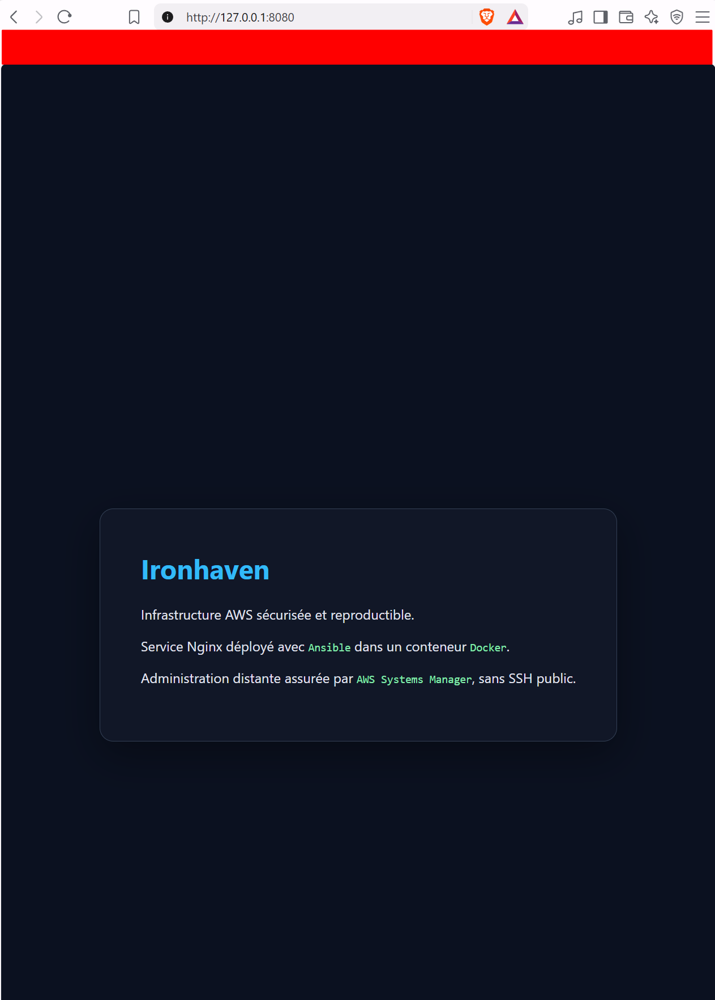

# Ironhaven

Infrastructure AWS sécurisée et reproductible, provisionnée avec Terraform, configurée avec Ansible et administrée sans exposition publique de SSH.

## Objectif du projet

Ironhaven est un projet pratique consacré au cycle de vie complet d’une infrastructure cloud sécurisée : provisionnement, configuration, durcissement, validation, supervision et destruction contrôlée.

L’objectif est de construire une architecture AWS segmentée et reproductible, puis d’automatiser sa configuration avec Ansible. Une attention particulière est portée au principe du moindre privilège, à la traçabilité, à la maintenabilité et à la maîtrise des coûts.

## Architecture

L’infrastructure est déployée dans la région AWS `eu-west-3` et comprend actuellement :

- un VPC dédié `10.42.0.0/16` ;
- un sous-réseau public et deux sous-réseaux privés ;
- une Internet Gateway et une table de routage publique ;
- trois groupes de sécurité représentant les couches management, application et données ;
- un rôle IAM et un instance profile dédiés à AWS Systems Manager ;
- une instance EC2 Amazon Linux 2023 administrée avec Session Manager ;
- un bucket S3 privé et chiffré pour les transferts temporaires Ansible ;
- une configuration Linux de base et plusieurs contrôles de durcissement ;
- un service Nginx conteneurisé, déployé et validé avec Ansible.

L’instance de management ne possède aucune règle entrante. Aucun port SSH n’est exposé et aucune clé privée n’est nécessaire pour son administration.

Le service Nginx de démonstration écoute uniquement sur `127.0.0.1:8080` à l’intérieur de l’instance. Il peut être consulté depuis le poste local avec un tunnel AWS Systems Manager, sans ouvrir de port entrant supplémentaire.



La documentation détaillée est disponible dans :

- [Architecture AWS](docs/architecture.md)
- [Administration avec Ansible](docs/ansible.md)
- [Service conteneurisé Nginx](docs/container.md)
- [Décisions techniques](docs/decisions.md)
- [Troubleshooting](docs/troubleshooting.md)

## Sécurité

Les principaux contrôles actuellement appliqués sont :

- authentification MFA pour l’utilisateur AWS du projet ;
- politique IAM dédiée aux opérations du projet ;
- segmentation réseau en plusieurs couches ;
- groupes de sécurité restrictifs ;
- absence de règle entrante ouverte sur Internet ;
- administration par AWS Systems Manager Session Manager ;
- métadonnées EC2 limitées à IMDSv2 ;
- volume système chiffré ;
- bucket de transfert Ansible chiffré, privé et nettoyé automatiquement ;
- synchronisation temporelle avec `chronyd` ;
- journalisation système avec `auditd` ;
- authentification SSH par mot de passe et connexion directe de `root` désactivées ;
- service Nginx lié uniquement à l’interface locale ;
- contenu web monté en lecture seule dans le conteneur ;
- validation automatique de la réponse HTTP ;
- exclusion du state Terraform et des informations sensibles du dépôt Git.

## Automatisation Ansible

Deux playbooks sont actuellement disponibles :

| Playbook | Fonction |
|---|---|
| `baseline.yml` | Mise à jour, outils d’administration, synchronisation temporelle, audit et durcissement SSH |
| `container.yml` | Installation de Docker et déploiement du service Nginx conteneurisé |

Les deux playbooks ont été exécutés une seconde fois avec :

```text
changed=0
unreachable=0
failed=0
```

Ce résultat confirme leur idempotence sur l’environnement déployé.

Les collections nécessaires sont versionnées dans `ansible/requirements.yml`.

## Technologies

### Actuellement utilisées

- AWS
- Terraform
- Ansible
- Docker
- Nginx
- AWS IAM
- AWS Systems Manager
- Amazon EC2
- Amazon S3
- Amazon Linux 2023
- Git et GitHub
- WSL2 Ubuntu

### Prévues

- Amazon CloudWatch
- GitHub Actions
- analyse de sécurité des conteneurs avec Trivy
- composant de sécurité pour agent IA

## État du projet

### Terminé

- [x] Configuration sécurisée de l’accès AWS avec MFA
- [x] Mise en place du socle Terraform
- [x] Création du VPC et des trois sous-réseaux
- [x] Configuration du routage public
- [x] Création des groupes et règles de sécurité
- [x] Création du rôle IAM et de l’instance profile SSM
- [x] Déploiement d’une instance EC2 Amazon Linux 2023
- [x] Validation de l’administration sans SSH avec Session Manager
- [x] Création du bucket de transfert temporaire Ansible
- [x] Validation de la connexion Ansible via SSM
- [x] Automatisation de la configuration de base avec Ansible
- [x] Application de contrôles de durcissement Linux
- [x] Vérification de l’idempotence des playbooks
- [x] Installation et activation de Docker
- [x] Déploiement d’un service Nginx conteneurisé
- [x] Validation du service avec un tunnel SSM
- [x] Documentation du réseau, de l’administration et du service conteneurisé

### Prochaines étapes

- [ ] Déployer ou simuler la couche de données
- [ ] Ajouter la journalisation et la supervision avec CloudWatch
- [ ] Ajouter l’analyse de l’image avec Trivy
- [ ] Mettre en place les contrôles de sécurité pour agent IA
- [ ] Ajouter les validations CI avec GitHub Actions
- [ ] Tester la reconstruction et la destruction complète de l’environnement
- [ ] Finaliser la documentation du projet

## Structure du dépôt

```text
.
├── ansible/
│   ├── ansible.cfg
│   ├── inventory/
│   │   └── hosts.yml
│   ├── playbooks/
│   │   ├── baseline.yml
│   │   └── container.yml
│   └── requirements.yml
├── docs/
│   ├── ansible.md
│   ├── architecture.md
│   ├── container.md
│   ├── decisions.md
│   ├── troubleshooting.md
│   └── screenshots/
└── terraform/
    ├── compute.tf
    ├── iam.tf
    ├── network.tf
    ├── outputs.tf
    ├── provider.tf
    ├── routing.tf
    ├── security.tf
    ├── storage.tf
    ├── variables.tf
    └── versions.tf
```

## Maîtrise des coûts

L’instance EC2 est arrêtée lorsqu’elle n’est pas utilisée. Le bucket S3 applique une expiration automatique aux objets temporaires et aucune NAT Gateway n’est actuellement déployée.

Les ressources restent néanmoins provisionnées par Terraform afin de permettre leur redémarrage et leur validation avant la destruction finale.

## Avertissement

Ce dépôt correspond à un environnement de laboratoire et de démonstration. Les ressources AWS sont temporaires et doivent être arrêtées ou détruites lorsqu’elles ne sont pas utilisées afin de limiter les coûts.
