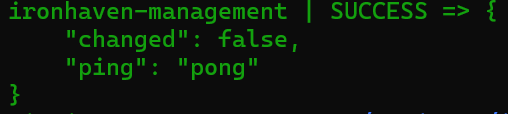

# Administration avec Ansible — Ironhaven

## Objectif

Ansible automatise la configuration de l’instance de management sans utiliser SSH. La connexion passe par AWS Systems Manager Session Manager avec le plugin `amazon.aws.aws_ssm`.

Cette méthode évite :

- l’ouverture du port TCP `22` ;
- la gestion d’une clé privée SSH ;
- l’exposition d’un service d’administration sur Internet ;
- la copie d’identifiants AWS sur l’instance.

## Chaîne de connexion

1. Ansible s’exécute depuis WSL2.
2. Le profil AWS `ironhaven` authentifie l’utilisateur local.
3. Le plugin Ansible ouvre une session Systems Manager vers l’instance EC2.
4. Les modules Ansible sont déposés temporairement dans le bucket S3 dédié.
5. L’instance télécharge et exécute les modules par HTTPS.
6. Les fichiers temporaires sont supprimés à la fin de l’exécution.

## Prérequis locaux

Les composants suivants sont nécessaires sur le poste de contrôle :

- Ansible Core ;
- collection `amazon.aws` ;
- AWS CLI ;
- Session Manager Plugin ;
- bibliothèques Python `boto3`, `botocore` et `awscrt`.

Ansible étant installé avec `pipx`, les dépendances AWS doivent être présentes dans le même environnement isolé :

```bash
pipx inject ansible boto3 botocore
pipx runpip ansible install 'botocore[crt]'
```

La collection AWS peut être vérifiée avec :

```bash
ansible-galaxy collection list amazon.aws
```

## Configuration

Le fichier `ansible/ansible.cfg` définit l’inventaire, l’interpréteur Python et le répertoire temporaire local.

Le fichier `ansible/inventory/hosts.yml` contient :

- le groupe `management` ;
- le nom logique `ironhaven-management` ;
- l’identifiant de l’instance EC2 ;
- la région AWS ;
- le profil AWS local ;
- le bucket S3 utilisé pour les transferts ;
- le chiffrement `AES256` des objets transférés.

L’identifiant d’instance et le nom du bucket ne sont pas des secrets. Aucune clé d’accès AWS n’est stockée dans l’inventaire.

## Validation de l’inventaire

Depuis le répertoire `ansible/` :

```bash
ansible-inventory --graph
```

Le groupe `management` doit contenir l’hôte `ironhaven-management`.

## Test de connexion

La chaîne complète est testée avec :

```bash
AWS_PROFILE=ironhaven ansible management \
  -m ansible.builtin.ping \
  -vv
```

Le résultat attendu est :

```text
ironhaven-management | SUCCESS => {
    "changed": false,
    "ping": "pong"
}
```



Le module `ping` d’Ansible n’est pas un ping ICMP. Il vérifie qu’Ansible peut transférer un module Python, l’exécuter sur la machine distante et récupérer son résultat.

## Bucket de transfert

Le bucket S3 est réservé aux transferts temporaires du plugin SSM. Il applique :

- le blocage de tous les accès publics ;
- le chiffrement serveur `AES256` ;
- une expiration automatique après un jour ;
- l’abandon des transferts incomplets après un jour ;
- l’absence de versioning.

Les objets sont normalement supprimés dès la fin d’une exécution Ansible. La règle d’expiration constitue une sécurité supplémentaire si une exécution est interrompue.

## État actuel

La connexion Ansible via Systems Manager est fonctionnelle. Aucun playbook de configuration ou de durcissement n’est encore appliqué.

Les prochaines étapes sont :

1. collecter les informations système sans modifier l’instance ;
2. créer un playbook de configuration de base ;
3. ajouter progressivement les contrôles de durcissement Linux ;
4. vérifier l’idempotence des playbooks.
