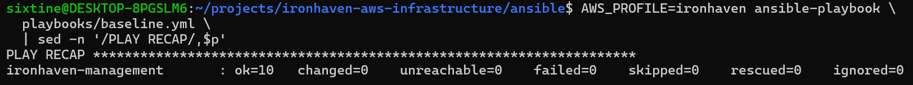

# Administration avec Ansible — Ironhaven

## Objectif

Ansible automatise la configuration et le durcissement de l’instance de management sans utiliser SSH.

La connexion passe par AWS Systems Manager Session Manager avec le plugin `amazon.aws.aws_ssm`. Cette méthode évite :

- l’ouverture du port TCP `22` ;
- la gestion d’une clé privée SSH ;
- l’exposition d’un service d’administration sur Internet ;
- la copie d’identifiants AWS sur l’instance.

## Chaîne de connexion

1. Ansible s’exécute depuis WSL2.
2. Le profil AWS `ironhaven` authentifie l’utilisateur IAM local.
3. Le plugin Ansible ouvre une session Systems Manager vers l’instance EC2.
4. Les modules Ansible sont transférés temporairement avec le bucket S3 dédié.
5. L’instance télécharge et exécute les modules par HTTPS.
6. Les fichiers temporaires sont supprimés à la fin de l’exécution.

L’instance dispose du rôle IAM nécessaire à Systems Manager. Aucune clé d’accès AWS n’est enregistrée sur la machine distante.

## Prérequis locaux

Les composants suivants sont nécessaires sur le poste de contrôle :

- Ansible Core ;
- collection `amazon.aws` ;
- AWS CLI ;
- Session Manager Plugin ;
- bibliothèques Python `boto3`, `botocore` et `awscrt`.

Ansible étant installé avec `pipx`, les dépendances AWS doivent être présentes dans le même environnement isolé :

```bash
pipx inject ansible boto3 botocore
pipx runpip ansible install 'botocore[crt]'
```

La collection AWS peut être vérifiée avec :

```bash
ansible-galaxy collection list amazon.aws
```

## Configuration

Le fichier `ansible/ansible.cfg` définit notamment :

- l’inventaire utilisé ;
- l’interpréteur Python ;
- le répertoire temporaire local.

Le fichier `ansible/inventory/hosts.yml` contient :

- le groupe `management` ;
- le nom logique `ironhaven-management` ;
- l’identifiant de l’instance EC2 ;
- la région AWS ;
- le profil AWS local ;
- le bucket S3 utilisé pour les transferts ;
- le chiffrement `AES256` des objets transférés.

L’identifiant d’instance et le nom du bucket ne sont pas des secrets. Aucune clé d’accès AWS n’est stockée dans l’inventaire.

## Validation de l’inventaire

Depuis le répertoire `ansible/` :

```bash
ansible-inventory --graph
```

Le groupe `management` doit contenir l’hôte `ironhaven-management`.

## Test de connexion

La chaîne complète est testée avec :

```bash
AWS_PROFILE=ironhaven ansible management \
  -m ansible.builtin.ping \
  -vv
```

Le résultat attendu est :

```text
ironhaven-management | SUCCESS => {
    "changed": false,
    "ping": "pong"
}
```


Le module `ping` d’Ansible n’est pas un ping ICMP. Il vérifie qu’Ansible peut transférer un module Python, l’exécuter sur la machine distante et récupérer son résultat.

## Bucket de transfert

Le bucket S3 est réservé aux transferts temporaires du plugin SSM. Il applique :

- le blocage de tous les accès publics ;
- le chiffrement serveur `AES256` ;
- une expiration automatique des objets après un jour ;
- l’abandon des transferts incomplets après un jour ;
- l’absence de versioning.

Les objets sont normalement supprimés dès la fin d’une exécution Ansible. La règle d’expiration constitue une sécurité supplémentaire si une exécution est interrompue.

## Playbook de configuration de base

Le playbook `ansible/playbooks/baseline.yml` configure une base Linux commune et applique plusieurs mesures de durcissement à l’instance de management.

Il réalise les opérations suivantes :

- mise à jour des paquets installés ;
- installation des outils d’administration nécessaires ;
- configuration du fuseau horaire en UTC ;
- activation de la synchronisation temporelle ;
- activation de l’audit Linux ;
- ajout d’une configuration de durcissement SSH ;
- validation de la configuration SSH ;
- collecte et affichage des informations système.

### Paquets installés

Le playbook installe les paquets suivants :

| Paquet | Fonction |
|---|---|
| `audit` | Journalisation des événements de sécurité avec Linux Audit |
| `chrony` | Synchronisation de l’horloge système |
| `curl-minimal` | Requêtes HTTP et HTTPS sur Amazon Linux 2023 |
| `git` | Gestion de dépôts Git |
| `jq` | Traitement de données JSON en ligne de commande |
| `unzip` | Extraction d’archives ZIP |

Amazon Linux 2023 fournit par défaut `curl-minimal`. L’installation du paquet `curl` complet provoquerait un conflit avec celui-ci ; le playbook utilise donc explicitement `curl-minimal`.

### Services système

Le playbook vérifie que les services suivants sont activés au démarrage et en cours d’exécution :

- `chronyd`, pour la synchronisation temporelle ;
- `auditd`, pour la journalisation des événements de sécurité.

Une horloge fiable est nécessaire pour corréler correctement les journaux. Le service d’audit permet de conserver une trace des événements importants sur le système.

## Durcissement SSH

Même si aucun port SSH n’est exposé par le groupe de sécurité AWS, une configuration restrictive est déposée dans :

```text
/etc/ssh/sshd_config.d/99-ironhaven-hardening.conf
```

Les paramètres appliqués sont :

```text
PermitRootLogin no
PasswordAuthentication no
KbdInteractiveAuthentication no
X11Forwarding no
MaxAuthTries 3
```

Ces paramètres :

- interdisent la connexion directe avec le compte `root` ;
- désactivent l’authentification par mot de passe ;
- désactivent l’authentification interactive au clavier ;
- désactivent le transfert graphique X11 ;
- limitent le nombre de tentatives d’authentification.

Cette configuration constitue une mesure de défense en profondeur. L’administration normale de l’instance continue de passer exclusivement par AWS Systems Manager.

Avant tout redémarrage du service, le playbook valide la configuration avec :

```bash
/usr/sbin/sshd -t
```

Le service `sshd` n’est redémarré que lorsque le fichier de configuration est effectivement modifié.

## Exécution du playbook

Depuis le répertoire `ansible/`, la syntaxe est vérifiée avec :

```bash
AWS_PROFILE=ironhaven ansible-playbook \
  playbooks/baseline.yml \
  --syntax-check
```

Le playbook est ensuite exécuté avec :

```bash
AWS_PROFILE=ironhaven ansible-playbook \
  playbooks/baseline.yml
```

Une exécution réussie doit terminer avec :

```text
unreachable=0
failed=0
```

## Vérification de l’idempotence

Un playbook Ansible est idempotent lorsqu’une nouvelle exécution sur un système déjà conforme ne produit aucune modification supplémentaire.

Le playbook est donc exécuté une seconde fois :

```bash
AWS_PROFILE=ironhaven ansible-playbook \
  playbooks/baseline.yml
```

Le résultat obtenu est :

```text
ironhaven-management : ok=10 changed=0 unreachable=0 failed=0
```



La valeur `changed=0` confirme que la configuration demandée était déjà présente et qu’Ansible n’a effectué aucune modification inutile.

## État actuel

Les éléments suivants sont désormais opérationnels :

- connexion Ansible sans SSH via AWS Systems Manager ;
- transfert temporaire chiffré avec Amazon S3 ;
- configuration de base automatisée ;
- mise à jour et installation des outils d’administration ;
- synchronisation temporelle avec `chronyd` ;
- audit système avec `auditd` ;
- durcissement de la configuration SSH ;
- validation de la syntaxe SSH avant redémarrage ;
- exécution idempotente du playbook.

La prochaine étape consiste à automatiser avec Ansible l’installation de Docker et le déploiement d’un service Nginx conteneurisé.