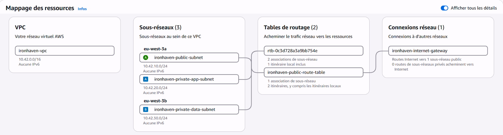
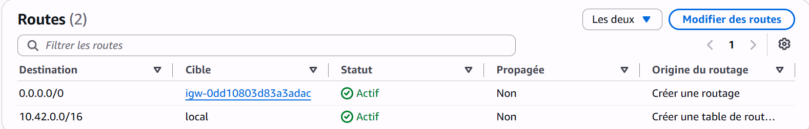
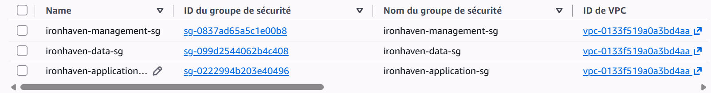
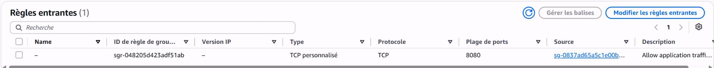
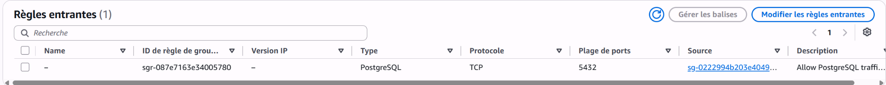

# Architecture réseau — Ironhaven

## Objectif

Ironhaven repose sur une architecture AWS segmentée en plusieurs couches afin de limiter les communications entre les ressources.

L’infrastructure est provisionnée avec Terraform dans la région `eu-west-3`. À ce stade, elle comprend le réseau, le routage et les groupes de sécurité. Les ressources de calcul seront ajoutées ultérieurement.

## Architecture générale

Le VPC utilise la plage privée `10.42.0.0/16` et contient trois sous-réseaux :

| Sous-réseau | CIDR | Zone | Fonction |
|---|---|---|---|
| `ironhaven-public-subnet` | `10.42.10.0/24` | `eu-west-3a` | Ressources nécessitant un accès Internet direct |
| `ironhaven-private-app-subnet` | `10.42.20.0/24` | `eu-west-3a` | Services applicatifs internes |
| `ironhaven-private-data-subnet` | `10.42.30.0/24` | `eu-west-3b` | Données et services sensibles |

Les couches application et données sont placées dans des sous-réseaux privés. Elles ne disposent d’aucune route directe vers Internet.

## Routage

Le sous-réseau public est associé à une table de routage contenant :

- une route locale `10.42.0.0/16` pour les communications internes au VPC ;
- une route par défaut `0.0.0.0/0` vers l’Internet Gateway.

Les deux sous-réseaux privés utilisent la table de routage principale du VPC, qui ne contient actuellement que la route locale.

Aucune NAT Gateway n’est déployée à ce stade. Ce choix évite un coût permanent inutile pendant la construction du projet et empêche les ressources privées d’accéder directement à Internet.

## Segmentation par groupes de sécurité

Trois groupes de sécurité représentent les différentes couches de l’architecture :

| Groupe de sécurité | Fonction |
|---|---|
| `ironhaven-management-sg` | Administration et futurs composants de gestion |
| `ironhaven-application-sg` | Services applicatifs |
| `ironhaven-data-sg` | Services de données |

Les groupes de sécurité sont associés aux ressources réseau, notamment aux interfaces des futures instances. Ils ne sont pas directement associés aux sous-réseaux.

## Flux autorisés

Le principe appliqué est celui du moindre privilège : seuls les flux nécessaires entre les différentes couches sont autorisés.

| Source | Destination | Protocole | Port | Usage |
|---|---|---:|---:|---|
| Management | Application | TCP | 8080 | Accès au service applicatif |
| Application | Data | TCP | 5432 | Accès à PostgreSQL |
| Management | Internet | TCP | 443 | Accès HTTPS sortant |
| Application | Internet | TCP | 443 | Accès HTTPS sortant |
| Management/Application | Résolveur DNS du VPC | TCP/UDP | 53 | Résolution DNS |

Aucun accès entrant provenant directement d’Internet n’est actuellement autorisé.

### Flux management vers application

Le groupe `ironhaven-application-sg` accepte le trafic TCP sur le port `8080` uniquement lorsqu’il provient du groupe `ironhaven-management-sg`.

### Flux application vers données

Le groupe `ironhaven-data-sg` accepte PostgreSQL sur le port TCP `5432` uniquement lorsque le trafic provient du groupe `ironhaven-application-sg`.

Le groupe de sécurité de la couche données n’autorise aucune connexion entrante depuis Internet ni depuis la couche management.

## Principes de sécurité

L’architecture applique les principes suivants :

- segmentation du réseau en couches public, application et données ;
- absence d’exposition directe des sous-réseaux privés ;
- filtrage des flux avec des références entre groupes de sécurité ;
- absence de règle entrante ouverte sur `0.0.0.0/0` ;
- administration future avec AWS Systems Manager Session Manager plutôt qu’avec un port SSH public ;
- permissions IAM dédiées au projet et limitées à la région `eu-west-3` ;
- authentification de l’utilisateur d’administration protégée par MFA ;
- infrastructure reproductible et supprimable avec Terraform ;
- exclusion de l’état Terraform et des informations sensibles du dépôt Git.

## État actuel

Les éléments suivants sont actuellement provisionnés :

- un VPC ;
- trois sous-réseaux ;
- une Internet Gateway ;
- une table de routage publique et son association ;
- trois groupes de sécurité ;
- neuf règles de sécurité distinctes.

Aucune instance EC2, adresse IPv4 publique facturable, NAT Gateway ou base de données managée n’est encore déployée.