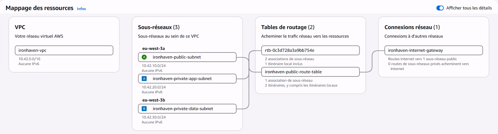
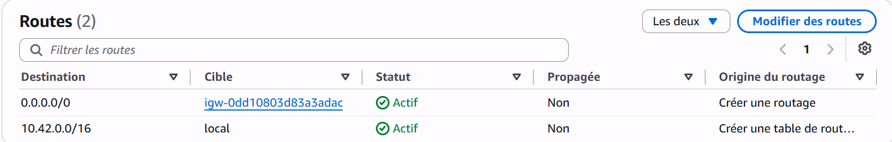
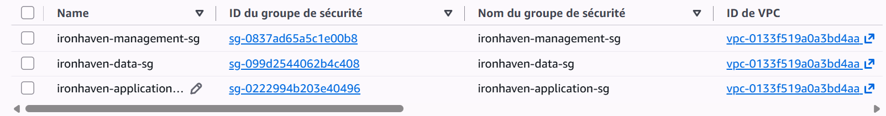
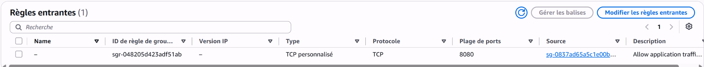
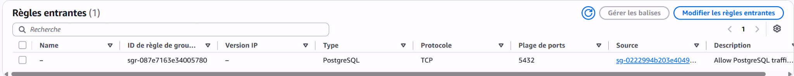
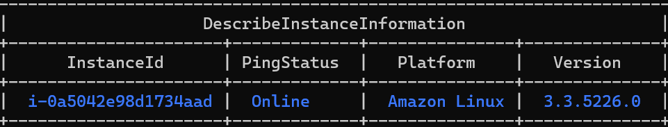
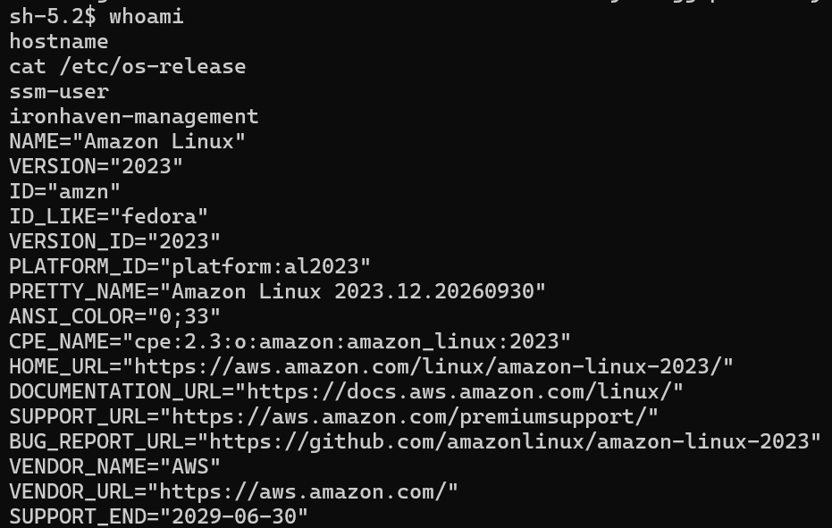

# Architecture AWS — Ironhaven

## Objectif

Ironhaven repose sur une architecture AWS segmentée en plusieurs couches afin de limiter les communications entre les ressources et de réduire leur surface d’exposition.

L’infrastructure est provisionnée avec Terraform dans la région `eu-west-3`. Elle comprend actuellement le réseau, le routage, les groupes de sécurité, les composants IAM nécessaires à Systems Manager et une instance EC2 de management.

## Architecture générale

Le VPC utilise la plage privée `10.42.0.0/16` et contient trois sous-réseaux :

| Sous-réseau | CIDR | Zone | Fonction |
|---|---|---|---|
| `ironhaven-public-subnet` | `10.42.10.0/24` | `eu-west-3a` | Management et ressources nécessitant un accès Internet direct |
| `ironhaven-private-app-subnet` | `10.42.20.0/24` | `eu-west-3a` | Services applicatifs internes |
| `ironhaven-private-data-subnet` | `10.42.30.0/24` | `eu-west-3b` | Données et services sensibles |

Les couches application et données sont placées dans des sous-réseaux privés. Elles ne disposent actuellement d’aucune route directe vers Internet.

## Routage

Le sous-réseau public est associé à une table de routage contenant :

- une route locale `10.42.0.0/16` pour les communications internes au VPC ;
- une route par défaut `0.0.0.0/0` vers l’Internet Gateway.

Les deux sous-réseaux privés utilisent la table de routage principale du VPC, qui ne contient actuellement que la route locale.

Aucune NAT Gateway n’est déployée. Ce choix évite un coût permanent inutile pendant la construction du projet et empêche les futures ressources privées d’accéder directement à Internet.

## Segmentation par groupes de sécurité

Trois groupes de sécurité représentent les différentes couches de l’architecture :

| Groupe de sécurité | Fonction |
|---|---|
| `ironhaven-management-sg` | Instance de management et futurs composants d’administration |
| `ironhaven-application-sg` | Services applicatifs |
| `ironhaven-data-sg` | Services de données |

Les groupes de sécurité sont associés aux interfaces réseau des ressources et non directement aux sous-réseaux.

## Flux autorisés

Le principe appliqué est celui du moindre privilège : seuls les flux nécessaires entre les différentes couches sont autorisés.

| Source | Destination | Protocole | Port | Usage |
|---|---|---:|---:|---|
| Management | Application | TCP | 8080 | Accès au service applicatif |
| Application | Data | TCP | 5432 | Accès à PostgreSQL |
| Management | Internet | TCP | 443 | AWS Systems Manager et dépendances HTTPS |
| Application | Internet | TCP | 443 | Flux autorisé par le groupe de sécurité, mais non routable sans NAT Gateway |
| Management/Application | Résolveur DNS du VPC | TCP/UDP | 53 | Résolution DNS |

Aucun accès entrant provenant directement d’Internet n’est autorisé.

La règle HTTPS sortante de la couche application prépare les futures dépendances applicatives. Le sous-réseau applicatif étant privé et dépourvu de NAT Gateway, ce trafic ne dispose actuellement d’aucune route vers Internet.

### Flux management vers application

Le groupe `ironhaven-application-sg` accepte le trafic TCP sur le port `8080` uniquement lorsqu’il provient du groupe `ironhaven-management-sg`.

### Flux application vers données

Le groupe `ironhaven-data-sg` accepte PostgreSQL sur le port TCP `5432` uniquement lorsque le trafic provient du groupe `ironhaven-application-sg`.

Le groupe de sécurité de la couche données n’autorise aucune connexion entrante depuis Internet ni directement depuis la couche management.

## Instance de management

Une instance EC2 est déployée dans le sous-réseau public avec les caractéristiques suivantes :

| Paramètre | Valeur |
|---|---|
| Nom | `ironhaven-management` |
| Système | Amazon Linux 2023 |
| Type | `t3.micro` |
| Stockage | volume racine `gp3` de 8 Gio |
| Chiffrement | activé |
| Administration | AWS Systems Manager Session Manager |
| SSH public | désactivé |
| IMDS | version 2 obligatoire |
| Suppression du volume | automatique avec l’instance |

L’instance dispose temporairement d’une adresse IPv4 publique afin de joindre les points de terminaison AWS Systems Manager par HTTPS.

Cette adresse ne permet pas d’initier une connexion entrante : le groupe de sécurité management ne contient aucune règle entrante.

## Administration avec Systems Manager

L’administration de l’instance utilise la chaîne suivante :

1. l’utilisateur s’authentifie sur AWS avec son profil protégé par MFA ;
2. AWS Systems Manager autorise l’ouverture d’une session ;
3. l’agent SSM installé sur Amazon Linux établit une communication HTTPS sortante ;
4. le rôle IAM de l’instance fournit uniquement les autorisations nécessaires à Systems Manager ;
5. la session ouvre un shell avec l’utilisateur `ssm-user`.

Aucune clé SSH, aucun mot de passe serveur et aucun port d’administration entrant ne sont nécessaires.

## IAM

L’instance utilise les composants suivants :

| Composant | Fonction |
|---|---|
| `ironhaven-management-role` | Rôle assumé par le service EC2 |
| `AmazonSSMManagedInstanceCore` | Autorisations nécessaires au fonctionnement de l’agent SSM |
| `ironhaven-management-profile` | Instance profile attachant le rôle IAM à l’EC2 |

Le rôle est attaché à la machine par Terraform. Les identifiants AWS de l’utilisateur ne sont jamais copiés sur l’instance.

## Principes de sécurité

L’architecture applique actuellement les principes suivants :

- segmentation du réseau en couches public, application et données ;
- absence d’exposition directe des sous-réseaux privés ;
- filtrage des flux avec des références entre groupes de sécurité ;
- absence de règle entrante ouverte sur `0.0.0.0/0` ;
- administration avec Session Manager plutôt qu’avec SSH ;
- absence de clé privée d’administration ;
- rôle IAM dédié à l’instance ;
- IMDSv2 obligatoire ;
- volume système chiffré ;
- permissions IAM du compte de déploiement limitées au projet ;
- authentification de l’utilisateur AWS protégée par MFA ;
- infrastructure reproductible avec Terraform ;
- exclusion du state Terraform et des informations sensibles du dépôt Git.

## État actuel

Les éléments suivants sont actuellement provisionnés :

- un VPC ;
- trois sous-réseaux ;
- une Internet Gateway ;
- une table de routage publique et son association ;
- trois groupes de sécurité ;
- neuf règles de sécurité distinctes ;
- un rôle IAM pour Systems Manager ;
- une association à la politique `AmazonSSMManagedInstanceCore` ;
- un instance profile ;
- une instance EC2 Amazon Linux 2023 ;
- un volume racine chiffré.

Ne sont pas encore déployés :

- la couche applicative ;
- la couche de données ;
- une NAT Gateway ;
- la centralisation des journaux ;
- l’automatisation Ansible ;
- le composant de sécurité pour agent IA.
