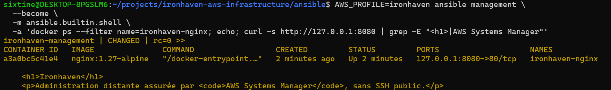

# Service conteneurisé Nginx — Ironhaven

## Objectif

Ironhaven déploie un service web de démonstration Nginx dans un conteneur Docker.

Le déploiement est entièrement automatisé avec Ansible et ne nécessite aucune connexion SSH. L’administration de l’instance passe par AWS Systems Manager Session Manager.

Le service permet de valider :

- l’installation automatisée de Docker ;
- le démarrage et l’activation du service Docker ;
- le déploiement idempotent d’un conteneur ;
- le montage en lecture seule du contenu web ;
- la vérification automatique de la réponse HTTP ;
- l’accès sécurisé au service avec un tunnel SSM.

## Périmètre actuel

À ce stade, le conteneur de démonstration fonctionne sur l’instance de management.

Ce choix permet de valider la chaîne Ansible, Docker, Nginx et SSM sans ajouter immédiatement une seconde instance EC2 ni une NAT Gateway.

Le service n’est pas destiné à rester sur l’instance de management dans une architecture de production. Une évolution future pourra le déplacer vers une instance dédiée dans le sous-réseau applicatif privé.

## Playbook Ansible

Le déploiement est défini dans :

```text
ansible/playbooks/container.yml
```

Le playbook réalise les opérations suivantes :

1. installation de Docker et de son SDK Python ;
2. activation et démarrage du service Docker ;
3. création du répertoire du contenu web ;
4. création de la page de démonstration Ironhaven ;
5. téléchargement de l’image Nginx ;
6. création et démarrage du conteneur ;
7. vérification de la réponse HTTP ;
8. validation du contenu retourné.

## Composants installés

Les paquets suivants sont installés avec `dnf` :

| Paquet | Fonction |
|---|---|
| `docker` | Moteur d’exécution des conteneurs |
| `python3-docker` | SDK Python utilisé par les modules Ansible Docker |

Le SDK Docker est installé depuis les dépôts Amazon Linux afin d’éviter de remplacer avec `pip` les bibliothèques Python gérées par RPM.

## Configuration du conteneur

Le conteneur utilise les paramètres suivants :

| Paramètre | Valeur |
|---|---|
| Nom | `ironhaven-nginx` |
| Image | `nginx:1.27-alpine` |
| Politique de redémarrage | `unless-stopped` |
| Adresse d’écoute | `127.0.0.1` |
| Port de l’hôte | `8080` |
| Port du conteneur | `80` |
| Contenu web | `/opt/ironhaven/nginx/html` |
| Montage | Lecture seule |

Le contenu web de l’hôte est monté dans le conteneur à l’emplacement :

```text
/usr/share/nginx/html
```

Le montage en lecture seule empêche le processus Nginx de modifier directement les fichiers fournis par Ansible.

## Absence d’exposition publique

Le port est publié avec la liaison suivante :

```text
127.0.0.1:8080:80
```

Le service écoute donc uniquement sur l’interface locale de l’instance EC2.

Il n’est accessible :

- ni directement depuis Internet ;
- ni avec l’adresse IPv4 publique de l’instance ;
- ni depuis une autre ressource du VPC.

Aucune règle entrante supplémentaire n’est ajoutée au groupe de sécurité AWS.

Cette configuration réduit la surface d’exposition tout en permettant de vérifier le service à travers Systems Manager.

## Validation automatisée

Après le démarrage du conteneur, Ansible effectue une requête vers :

```text
http://127.0.0.1:8080
```

Le playbook vérifie :

- que le serveur retourne le statut HTTP `200` ;
- que la réponse contient le nom `Ironhaven` ;
- que la réponse mentionne `AWS Systems Manager`.

Une exécution réussie affiche :

```text
Ironhaven Nginx service is healthy and serving the expected page.
```

## Vérification technique

L’état du conteneur et le contenu retourné peuvent être contrôlés avec Ansible :

```bash
AWS_PROFILE=ironhaven ansible management \
  --become \
  -m ansible.builtin.shell \
  -a 'docker ps --filter name=ironhaven-nginx; echo; curl -s http://127.0.0.1:8080 | grep -E "<h1>|AWS Systems Manager"'
```

La sortie confirme :

- l’utilisation de l’image `nginx:1.27-alpine` ;
- l’état actif du conteneur ;
- la liaison locale `127.0.0.1:8080->80/tcp` ;
- la présence du contenu Ironhaven.



## Accès avec un tunnel SSM

Le service peut être consulté depuis le navigateur local sans ouvrir de port entrant sur AWS.

Depuis la racine du dépôt :

```bash
INSTANCE_ID="$(terraform -chdir=terraform output -raw management_instance_id)"

AWS_PROFILE=ironhaven aws ssm start-session \
  --target "$INSTANCE_ID" \
  --document-name AWS-StartPortForwardingSession \
  --parameters '{"portNumber":["8080"],"localPortNumber":["8080"]}'
```

Tant que cette session reste ouverte, la page est accessible localement à l’adresse :

```text
http://127.0.0.1:8080
```

Le flux suit le chemin suivant :

```text
Navigateur local → tunnel SSM → instance EC2 → Nginx sur 127.0.0.1:8080
```


Le tunnel est fermé avec `Ctrl+C`. Aucun port entrant public n’est nécessaire.

## Idempotence

Le playbook a été exécuté une seconde fois après le déploiement initial.

Le résultat obtenu est :

```text
ironhaven-management : ok=8 changed=0 unreachable=0 failed=0
```

La valeur `changed=0` confirme qu’Ansible détecte l’état existant et n’effectue aucune modification inutile.

## Sécurité appliquée

Le service respecte actuellement les principes suivants :

- aucune ouverture de port SSH ;
- aucune ouverture publique du port applicatif ;
- accès administratif avec Systems Manager ;
- publication de Nginx uniquement sur l’interface locale ;
- contenu web monté en lecture seule ;
- image Nginx explicitement versionnée ;
- redémarrage automatique du conteneur ;
- vérification HTTP automatique ;
- déploiement reproductible et idempotent avec Ansible.

## Évolutions prévues

Les évolutions possibles sont :

- déplacer le service vers une instance dédiée dans le sous-réseau applicatif privé ;
- ajouter une image applicative construite par le projet ;
- analyser l’image avec Trivy ;
- centraliser les journaux avec CloudWatch ;
- vérifier automatiquement les playbooks avec GitHub Actions.